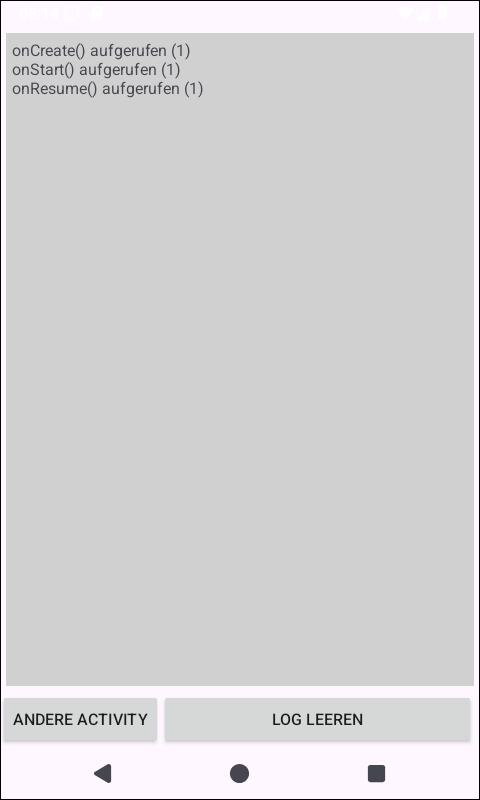
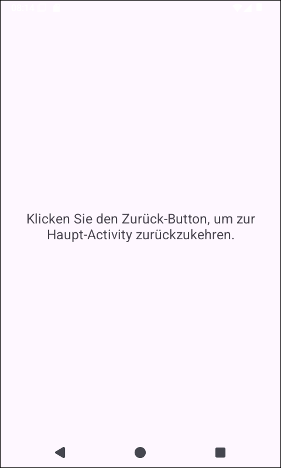
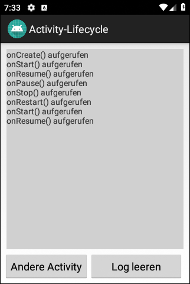

# Android-App "Activity Lifecycle Demo" #

 

Die App demonstriert verschiedene Lifecycle-Methoden der Klasse 
[Activity](https://developer.android.com/reference/android/app/Activity#activity-lifecycle).

 

----

## Screenshots ##

 

  

 

 

----

## License ##

 

See the [LICENSE file](LICENSE.md) for license rights and limitations (BSD 3-Clause License).

 
